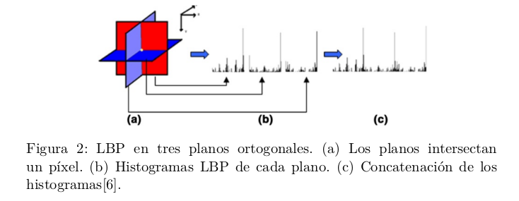
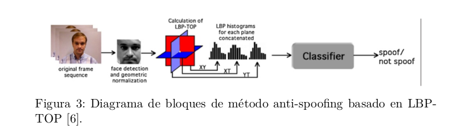

# Antispoofing

Se implementa la técnica antispoofing LBP-TOP que tiene por objetivo la detección de vida en los sistemas de identificación biometricos de rostros. La técnica LBP-TOP se fundamenta en el análisis de las texturas dinámicas de una secuencia (secuencia de frames de un video). 

Una secuencia de imágenes (video) puede ser representado espacialmente en 3 dimensiones, definidos por los ejes X,Y y T. Estos ejes definen los planos XY, XT e YT. El plano XY se identifica con las imágenes 2D de un vídeo y los planos XT e YT definen las variaciones temporales. El operador LBP es aplicado en cada uno de los planos que intersectan el píxel central de la secuencia (X/2,Y/2,T/2). Luego de cada imagen LBP se extrae un histograma, los histogramas de cada plano son concatenados para formar un vector de características,  como se muestra en la Figura 2. 

El método para la detección de vida consiste en preprocesas las imágenes utilizando un detector de rostros, generar las características con LBP-TOP y entrenar un clasificador binario. La secuencia de imágenes representa accesos reales y ataques utilizando fotografías de los individuos registrados en el sistema, como se muestra en el Figura 3.

La implementación logra un $96.6\%$ de accuracy en una base de 6 individuos, con 6 accesos reales y 6 ataques. De esta base de datos se logran obtener 150 secuencias de 75 frames. 

Para información mas detallada, dirigirse al [informe del proyecto.](https://drive.google.com/file/d/1EGIgjuwQsSFvuyTm7-TNY19YKG1jnPSj/view?usp=sharing)

